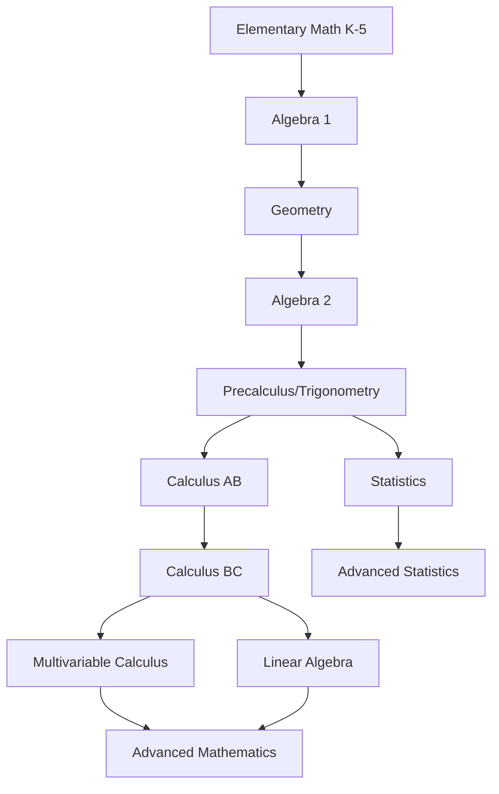

# 📐 Mathematics

**The language of the universe - from basic arithmetic to advanced mathematical concepts**

---

## 📋 Table of Contents

- [📚 How to Study Math](#-how-to-study-math)
- [🎯 K-5 Mathematics](#-k-5-mathematics)
- [🏫 High School Courses](#-high-school-courses)
  - [📊 Algebra 1](#-algebra-1)
  - [📐 Geometry](#-geometry)
  - [📈 Algebra 2](#-algebra-2)
  - [📉 Precalculus and Trigonometry](#-precalculus-and-trigonometry)
- [🎓 AP and College Courses](#-ap-and-college-courses)
  - [∫ AP/College Calculus AB](#-apcollege-calculus-ab)
  - [∫∫ AP/College Calculus BC](#-apcollege-calculus-bc)
  - [∇ Multivariable Calculus](#-multivariable-calculus)
  - [📊 Linear Algebra](#-linear-algebra)
  - [📈 AP/College Statistics](#-apcollege-statistics)
  - [🔬 Upper Level Mathematics](#-upper-level-mathematics)
- [🏆 Math Competitions](#-math-competitions)
- [🛠️ Online Tools](#️-online-tools)
- [📖 Other References](#-other-references)

---

## 📚 How to Study Math

### 🎯 Essential Study Strategies

<table>
<tr>
<td align="center" width="25%">

 <strong>📖 Understanding</strong>
 Focus on concepts, not memorization
</td>
<td align="center" width="25%">

 <strong>✏️ Practice</strong>
 Solve problems regularly
</td>
<td align="center" width="25%">

 <strong>🤝 Collaboration</strong>
 Study with peers and ask questions
</td>
<td align="center" width="25%">

 <strong>🔄 Review</strong>
 Regularly revisit previous topics
</td>
</tr>
</table>

- 📖 [**Understanding Mathematics**](https://github.com/nbro/understanding-math) - Comprehensive guide to overcoming problems when reading, writing, interpreting, and listening to mathematics.

---

## 🎯 K-5 Mathematics

### 🌟 Elementary Math Foundations

- 🎮 [**eSpark**](https://www.esparklearning.com) - Free interactive math lessons, games & activities for K-5 students.
- 🧮 [**Khan Academy Kids**](https://www.khanacademy.org/kids) - Personalized learning activities for young learners.
- 🎯 [**IXL Math K-5**](https://www.ixl.com/math/kindergarten) - Comprehensive K-5 math practice with adaptive questions.

---

## 🏫 High School Courses

### 📊 Algebra 1

**Building the foundation of algebraic thinking**

- 🎥 [**Professor Leonard Prealgebra**](https://www.youtube.com/playlist?list=PL4C9296DF81B9EF13) - Full-length lectures for prealgebra fundamentals.
- 📚 [**Professor Leonard Intermediate Algebra**](https://www.youtube.com/playlist?list=PLC292123722B1B450) - Comprehensive intermediate algebra course.
- 📖 [**Khan Academy Algebra 1**](https://www.khanacademy.org/math/algebra) - Interactive lessons and practice problems.

### 📐 Geometry

**Exploring shapes, space, and spatial reasoning**

> 🚧 **Help us expand this section!** Check out our [**Contributing Guide**](https://github.com/Awesome-Nexus/Awesome-Horizon/blob/main/CONTRIBUTING.md) to add quality geometry resources.

### 📈 Algebra 2

**Advanced algebraic concepts and functions**

> 🚧 **Help us expand this section!** Check out our [**Contributing Guide**](https://github.com/Awesome-Nexus/Awesome-Horizon/blob/main/CONTRIBUTING.md) to add quality Algebra 2 resources.

### 📉 Precalculus and Trigonometry

**Preparing for calculus with advanced functions and trigonometry**

- 🎥 [**Professor Leonard Precalculus**](https://www.youtube.com/playlist?list=PLDesaqWTN6ESsmwELdrzhcGiRhk5DjwLP) - Complete precalculus course with detailed explanations.
- 📖 [**Khan Academy Precalculus**](https://www.khanacademy.org/math/precalculus) - Comprehensive precalculus curriculum.

---

## 🎓 AP and College Courses

### ∫ AP/College Calculus AB

**Introduction to differential and integral calculus**

- 🎬 [**Essence of Calculus**](https://www.youtube.com/watch?v=WUvTyaaNkzM&list=PL0-GT3co4r2wlh6UHTUeQsrf3mlS2lk6x) - Beautiful animated explanations of calculus fundamentals by 3Blue1Brown.
- 📚 [**Calculus 1 Full Course**](https://www.youtube.com/watch?v=LWPzHlSBlxI&list=PLHXZ9OQGMqxfT9RMcReZ4WcoVILP4k6-m) - Complete calculus 1 course by Dr. Trefor Bazett.
- 🎯 [**Khan Academy AP Calculus AB**](https://www.khanacademy.org/math/ap-calculus-ab) - Comprehensive AP Calculus AB preparation.
- 🎥 [**Professor Leonard Calculus 1**](https://www.youtube.com/playlist?list=PLF797E961509B4EB5) - Full-length university-level calculus lectures.
- 📝 [**Paul's Online Notes Calculus 1**](https://tutorial.math.lamar.edu/Classes/CalcI/CalcI.aspx) - Detailed lecture notes and practice problems.

### ∫∫ AP/College Calculus BC

**Advanced calculus including series and additional integration techniques**

- 📚 [**Calculus 2 Full Course**](https://www.youtube.com/watch?v=i4c8n4S-Sp0&list=PLHXZ9OQGMqxc4ySKTIW19TLrT91Ik9M4n) - Integration methods, series, polar coordinates by Dr. Trefor Bazett.
- 🎯 [**Khan Academy AP Calculus BC**](https://www.khanacademy.org/math/ap-calculus-bc) - Complete AP Calculus BC curriculum.
- 🏫 [**MIT Single Variable Calculus**](https://ocw.mit.edu/courses/18-01-calculus-i-single-variable-calculus-fall-2020/) - Three-part MIT OpenCourseWare series.
- 🎥 [**Professor Leonard Calculus 2**](https://www.youtube.com/playlist?list=PLDesaqWTN6EQ2J4vgsN1HyBeRADEh4Cw-) - University-level calculus 2 lectures.
- 📖 [**The AP Calculus Problem Book**](http://crunchymath.weebly.com/uploads/8/2/4/0/8240213/apcalcprobbook.pdf) - Extensive practice problems for AP Calculus AB and BC.
- 📝 [**Paul's Online Notes Calculus 2**](https://tutorial.math.lamar.edu/Classes/CalcII/CalcII.aspx) - Comprehensive calculus 2 notes and problems.
- 📋 [**AP Calculus BC Notes**](https://docs.google.com/document/d/1YDFL622C8dRj-Z-2o1BMIUfQy4nGisp8cUVEg52-BHo/edit#) - Concise study notes and exam preparation.

### ∇ Multivariable Calculus

**Calculus in multiple dimensions - vectors, partial derivatives, and multiple integrals**

- 🎬 [**Multivariable Calculus Course**](https://www.youtube.com/playlist?list=PLHXZ9OQGMqxc_CvEy7xBKRQr6I214QJcd) - Complete multivariable calculus by Dr. Trefor Bazett.
- 🎯 [**Khan Academy Multivariable Calculus**](https://www.khanacademy.org/math/multivariable-calculus) - Interactive multivariable calculus curriculum.
- 🌊 [**Vector Calculus Course**](https://www.youtube.com/playlist?list=PLHXZ9OQGMqxfW0GMqeUE1bLKaYor6kbHa) - Line integrals, vector fields, and more by Dr. Trefor Bazett.
- 🏫 [**MIT Multivariable Calculus**](https://ocw.mit.edu/courses/18-02sc-multivariable-calculus-fall-2010/) - Complete MIT course on multivariable calculus.
- 🎥 [**Professor Leonard Calculus 3**](https://www.youtube.com/playlist?list=PLDesaqWTN6ESk16YRmzuJ8f6-rnuy0Ry7) - University-level calculus 3 lectures.
- 📝 [**Paul's Online Notes Calculus 3**](https://tutorial.math.lamar.edu/Classes/CalcIII/CalcIII.aspx) - Detailed calculus 3 notes and practice.
- 📚 [**OpenStax Calculus Volume 3**](https://openstax.org/details/books/calculus-volume-3) - Free digital multivariable calculus textbook.

### 📊 Linear Algebra

**Matrix theory, vector spaces, and linear transformations**

- 🏫 [**MIT Linear Algebra**](https://ocw.mit.edu/courses/18-06sc-linear-algebra-fall-2011/) - Complete MIT course on matrix theory and linear algebra.
- 🎬 [**3Blue1Brown: Linear Algebra Intuition**](https://youtube.com/playlist?list=PL0-GT3co4r2y2YErbmuJw2L5tW4Ew2O5B) - Beautiful visual explanations of linear algebra concepts.
- 🎥 [**Kimberly Brehm's Linear Algebra**](https://youtube.com/playlist?list=PLl-gb0E4MII03hiCrZa7YqxUMEeEPmZqK) - Complete undergraduate linear algebra course.
- 📚 [**Jim Hefferon's Linear Algebra**](https://joshua.smcvt.edu/linearalgebra/) - Free linear algebra textbook with solutions.

### 📈 AP/College Statistics

**Data analysis, probability, and statistical inference**

- 🎯 [**Khan Academy AP/College Statistics**](https://www.khanacademy.org/math/ap-statistics) - Complete introductory statistics curriculum.
- 📋 [**MIT Statistics Cheat Sheet**](https://web.mit.edu/~csvoss/Public/usabo/stats_handout.pdf) - Essential formulas and definitions.
- 📝 [**AP Statistics Cram Sheet**](http://apsurvivall.weebly.com/uploads/1/2/6/5/12651629/ap_statistics_cram.pdf) - Key concepts and formulas for AP Statistics.

### 🔬 Upper Level Mathematics

**Advanced mathematical topics for serious students**

- 📖 [**Napkin.pdf**](https://venhance.github.io/napkin/Napkin.pdf) - Making higher mathematics accessible to high school students through succinct, progressive exploration.

#### 📊 Upper Level Statistics

- 📚 [**Janos Englander's Intro to Probability**](https://sites.google.com/view/englandj/math-4510?pli=1) - Textbook and homework for calculus-based probability.
- 🎥 [**Patrick Brazil's Introduction to Probability**](https://www.youtube.com/playlist?list=PLUTn30k919O_dwIAqUqq37gNQJFHCDQ2D) - Calculus-based probability course.
- 📈 [**Jem Conrocran's Mathematical Statistics**](https://www.youtube.com/playlist?list=PLLyj1Zd4UWrOk5-wIki_oOxHJnNj0_437) - Advanced mathematical statistics.
- 🏫 [**MIT Probability and Random Variables**](https://ocw.mit.edu/courses/18-440-probability-and-random-variables-spring-2014/) - Complete MIT probability course.
- 📊 [**MIT Statistics for Applications**](https://ocw.mit.edu/courses/18-650-statistics-for-applications-fall-2016/) - Applied statistics with real-world examples.

---

## 🏆 Math Competitions

### 🥇 Competitive Mathematics

**Challenge yourself with mathematical problem-solving competitions**

- 🧩 [**Art of Problem Solving**](https://artofproblemsolving.com/wiki/) - Comprehensive database of competition problems with detailed solutions:
  - 🏅 AMC 8, AMC 12, and AIME exam problems
  - 📚 Specialized topics like number theory
  - 💡 Problem-solving strategies and techniques

---

## 🛠️ Online Tools

### 🔧 Mathematical Computing Tools

<table>
<tr>
<td align="center" width="25%">

 <strong>📊 Graphing</strong>
 Visualize functions and data
</td>
<td align="center" width="25%">

 <strong>🧮 Calculation</strong>
 Solve complex equations
</td>
<td align="center" width="25%">

 <strong>📐 Geometry</strong>
 Interactive geometric constructions
</td>
<td align="center" width="25%">

 <strong>💰 Finance</strong>
 Financial calculations
</td>
</tr>
</table>

#### 📊 Graphing & Visualization
- 📈 [**Desmos**](https://www.desmos.com) - Advanced graphing and scientific calculators
- 🌐 [**GeoGebra**](https://www.geogebra.org/?lang=en) - Interactive 3D graphing and geometry
- 🎯 [**Mathigon**](https://mathigon.org/) - Interactive math courses and manipulatives

#### 🧮 Problem Solving
- 🔍 [**Symbolab**](https://www.symbolab.com) - Step-by-step math solver
- 🧠 [**WolframAlpha**](https://www.wolframalpha.com) - Computational knowledge engine
- ∫ [**4th Derivative Calculator**](https://calculator-derivative.com/fourth-derivative-calculator) - Advanced calculus calculations
- ∫ [**Indefinite Integration Calculator**](https://calculator-integral.com/indefinite-integral-calculator) - Integration problem solver

#### 💰 Financial Mathematics
- 💹 [**Finance Charts**](https://www.financecharts.com/pages/5724-retirement-calculators-and-stock-market-tips) - Everyday finance calculations and retirement planning

---

## 📖 Other References

### 📚 Additional Mathematical Resources

- 📖 [**MathWords**](http://www.mathwords.com) - Comprehensive dictionary of mathematical terms, formulas, and diagrams
- ❓ [**Math StackExchange**](https://math.stackexchange.com) - Q&A community for mathematics at all levels
- 🎓 [**Math Overflow**](https://mathoverflow.net) - Q&A site for professional mathematicians and advanced students

---

## 🌟 Mathematics Learning Path

### 🎯 Recommended Progression

---

**🎓 Master the language of the universe, one equation at a time! 🎓**

